# Real Estate Tokenization Platform

A comprehensive platform for tokenizing real estate assets on the
Hedera network, enabling fractional ownership, automated dividend
 distributions, and decentralized governance.

<a id="table-of-contents"></a>

## 📋 Table of Contents

- [Project Overview](#project-overview)
- [System Architecture](#system-architecture)
- [How The System Works](#how-the-system-works)
- [Key Features](#key-features)
- [Database Schema](#database-schema)
- [Getting Started](#getting-started)
- [Smart Contract Integration](#smart-contract-integration)
- [Testing](#testing)
- [Architecture Diagrams](#architecture-diagrams)
- [Pitch Deck & Certifications](#pitch-deck-certifications)

<a id="project-overview"></a>

## 🏢 Project Overview

This platform enables property owners to tokenize their real estate
assets and investors to purchase fractional ownership through
blockchain-based tokens. The system handles the complete lifecycle
from property registration to token distribution, dividend payments,
and governance voting.

### Core Capabilities

- **Property Tokenization**: Convert real estate assets into fungible tokens on Hedera
- **Fractional Investment**: Enable investors to purchase property fractions
starting from small amounts
- **Automated Dividends**: Distribute rental income and other returns to token holders
- **Decentralized Governance**: Token holders vote on property decisions
(maintenance, sales, etc.)
- **Multi-Signature Treasury**: Secure fund management with approval workflows
- **KYC Compliance**: Tiered verification system with investment limits
- **Payment Processing**: Support for NGN payments via Paystack
- **Activity Logging**: Complete audit trail recorded on Hedera Consensus
Service (HCS)

### Technology Stack

**Frontend:**

- React 18 with TypeScript
- Vite for build tooling
- TailwindCSS + shadcn/ui for styling
- TanStack Query for state management
- React Router for navigation

**Backend:**

- Supabase (PostgreSQL database + Edge Functions)
- Hedera SDK for blockchain interactions
- Smart contracts (Solidity) deployed on Hedera

**Blockchain:**

- Hedera Hashgraph Network
- Hedera Token Service (HTS) for tokenization
- Hedera Consensus Service (HCS) for activity logging
- Hedera File Service (HFS) for document storage

<a id="system-architecture"></a>

## 🏗️ System Architecture

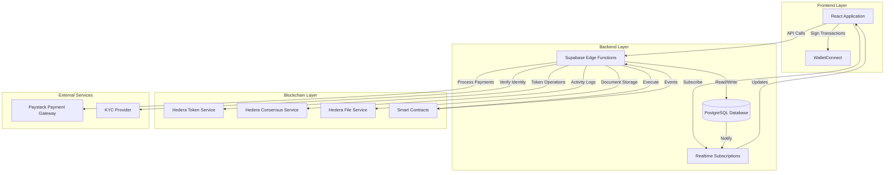

### Component Responsibilities

### Frontend (React)

- User interface and interaction
- Form validation and user input
- Real-time data display
- Wallet connection via WalletConnect
- Route-based access control

### Edge Functions (Supabase)

- Business logic execution
- Hedera blockchain interactions
- Smart contract calls
- Payment processing
- KYC verification workflows
- Activity logging to HCS

### Database (PostgreSQL)

- User accounts and profiles
- Property listings and tokenizations
- Investment records and holdings
- Transaction history
- Smart contract configuration
- Activity logs

### Smart Contracts (Solidity)

- Governance proposal execution
- Dividend distribution management
- Multi-signature treasury operations
- Platform escrow for investments

<a id="how-the-system-works"></a>

## 🔄 How The System Works

### For Investors

#### 1. **Account Creation & KYC**

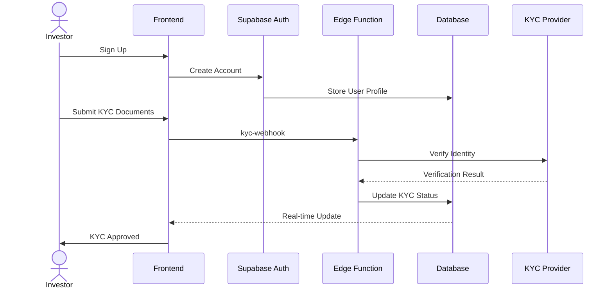

- User creates account with email/password
- Submits KYC documents (ID, address proof, selfie)
- System verifies identity through KYC provider
- Assigns investment tier based on verification level
  - **Tier 1**: Up to ₦5M investment limit
  - **Tier 2**: Up to ₦50M investment limit
  - **Tier 3**: Unlimited investment

#### 2. **Wallet Setup**

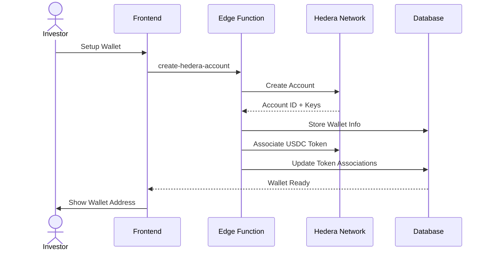

- Automatic Hedera account creation
- USDC token association for payments
- Secure key management
- Wallet balance tracking

#### 3. **Investment Flow**

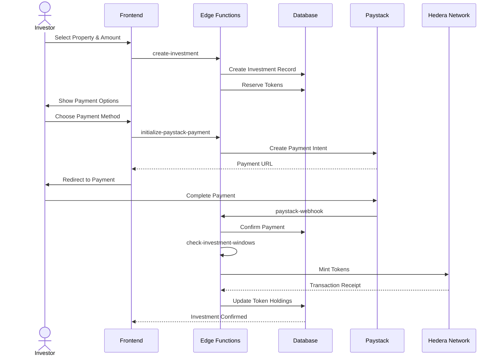

**Steps:**

1. Browse properties and view tokenization details
2. Enter investment amount (respecting KYC limits)
3. Review terms and accept tokenization agreement
4. Choose payment method (Paystack for NGN)
5. Complete payment securely
6. System reserves tokens during investment window
7. Tokens automatically minted and distributed when window closes
8. Investment confirmation and document generation

#### 4. **Portfolio Management**

- View all property holdings
- Track token balances per property
- Monitor unrealized returns
- Access investment documents
- View transaction history

#### 5. **Dividend Claiming**

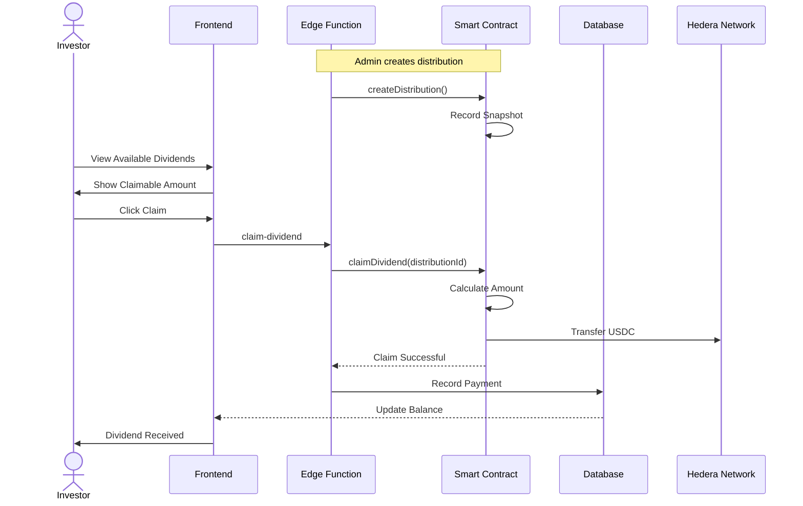

- Property owners record rental income
- System creates dividend distribution
- Proportional allocation based on token holdings
- One-click claiming from smart contract
- Automatic USDC transfer to wallet

#### 6. **Governance Voting**

- View active proposals (maintenance, sales, major decisions)
- Cast votes weighted by token holdings
- Track proposal status and outcomes
- Participate in property management decisions

### For Property Owners

#### 1. **Property Registration**

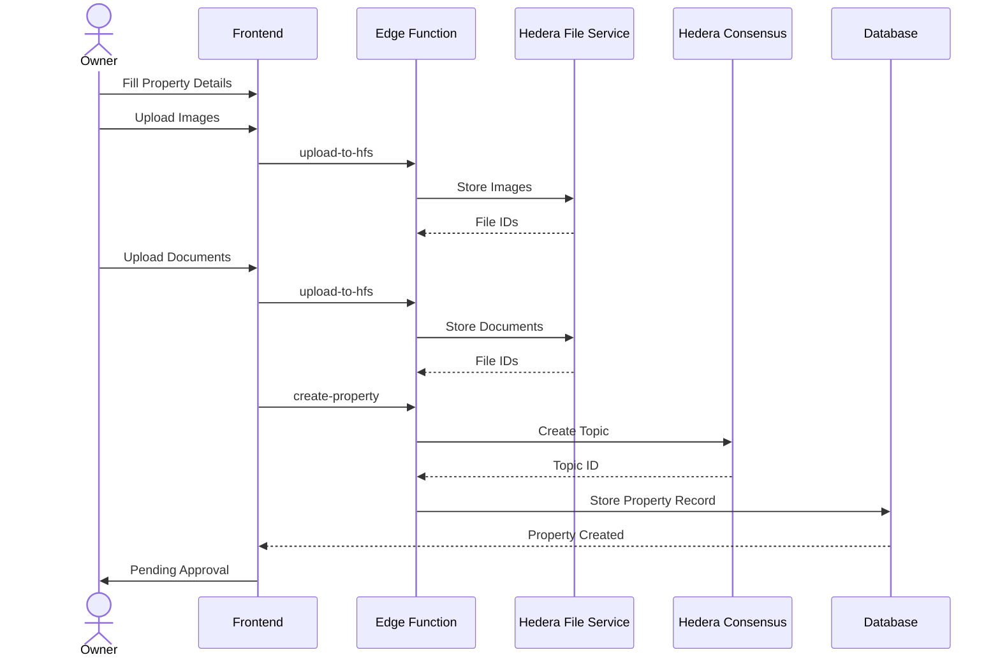

**Steps:**

1. Enter property details (location, size, type, value)
2. Upload property images
3. Upload legal documents (title deed, survey, permits)
4. System creates HCS topic for activity tracking
5. Submits for admin approval
6. Receives approval notification

#### 2. **Tokenization Setup**

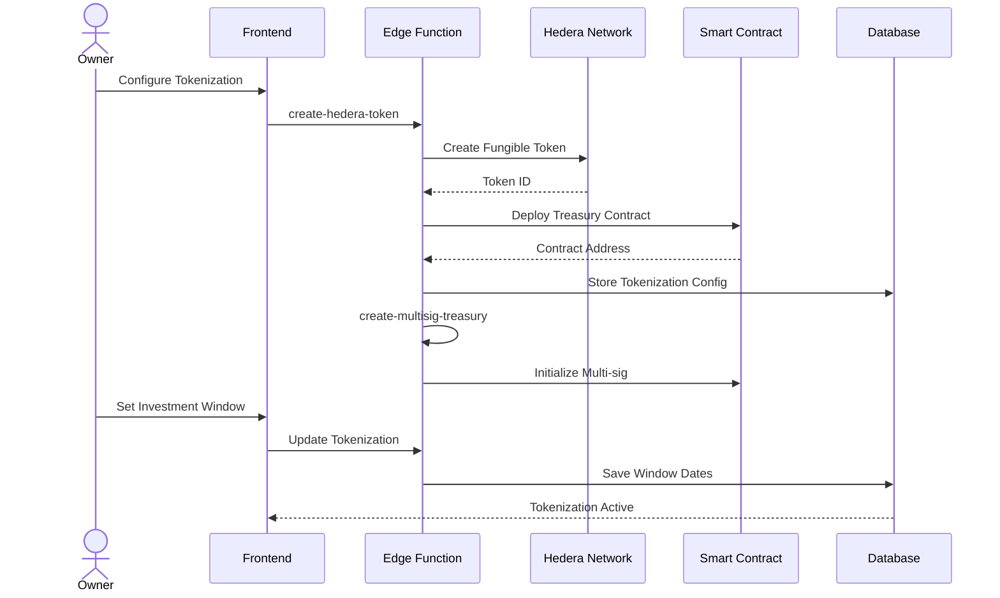

**Configuration:**

- Token symbol and decimals
- Total token supply
- Token price (NGN/USD per token)
- Minimum investment amount
- Investment window (start/end dates)
- Fund allocation breakdown
- Use of funds documentation

**Multi-sig Treasury Setup:**

- Define signers (owner + co-signers)
- Set approval threshold (e.g., 2 of 3)
- Configure withdrawal limits

#### 3. **Investment Window Management**

- Monitor investment progress in real-time
- View reserved vs. allocated tokens
- Track total funds raised
- Close window manually or automatically
- Automated token minting at window closure

#### 4. **Event Recording**

Property owners record various events that affect token holders:

**Rental Income:**

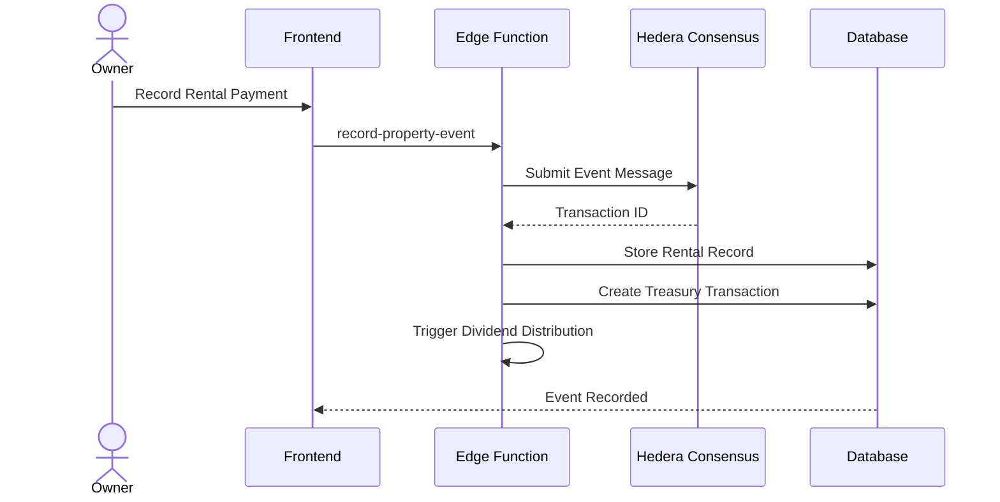

**Maintenance Events:**

- Create maintenance proposal
- Token holders vote on approval
- Execute maintenance with contractor details
- Record costs and upload receipts
- Update property condition status

**Inspection Reports:**

- Schedule property inspection
- Upload inspection photos and reports
- Record condition assessments
- Update property valuation

**Purchase/Sale Transactions:**

- Record partial or full property sales
- Update token holder ownership
- Distribute sale proceeds

#### 5. **Treasury Management**

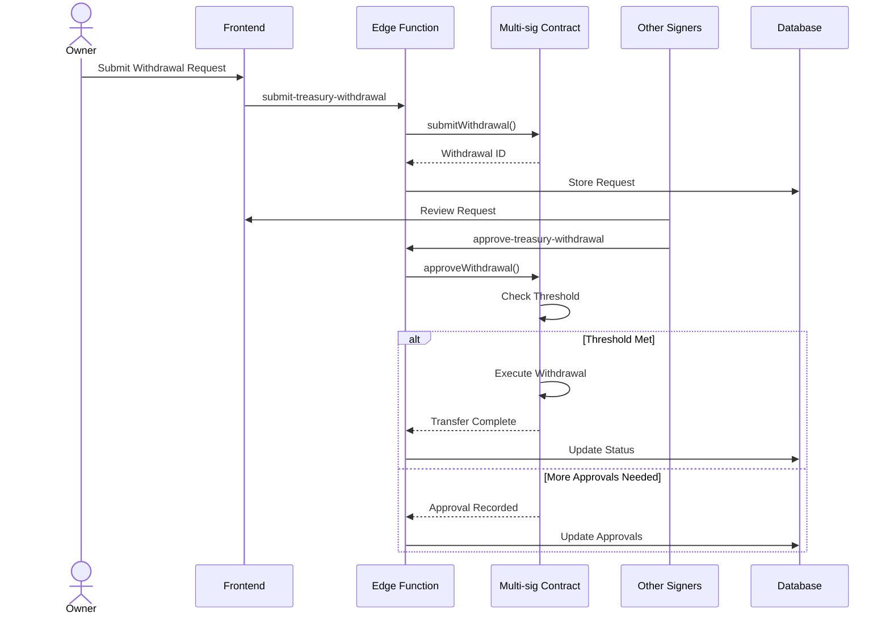

**Features:**

- Submit withdrawal requests with justification
- Multi-signature approval workflow
- Spending limits and controls
- Complete transaction history
- Real-time balance tracking

### Smart Contract Integration

#### Governance Flow

The platform uses the **GovernanceExecutor** smart contract for on-chain
proposal management:

1. **Proposal Creation**: Token holders create proposals (maintenance, major decisions)
2. **On-chain Registration**: Proposal registered to smart contract with voting parameters
3. **Voting Period**: Token holders cast votes (for/against/abstain)
4. **Execution**: If approved, proposal funds are locked in contract
5. **Completion**: Upon completion, funds are released to executor

#### Dividend Distribution Flow

The **DividendDistributor** smart contract manages automated dividend payouts:

1. **Distribution Creation**: Property owner records income and creates distribution
2. **Snapshot**: Contract takes snapshot of token holdings at specific block
3. **Claiming**: Investors claim their proportional share from the contract
4. **Automatic Transfer**: USDC transferred directly to investor wallets
5. **Expiry**: Unclaimed dividends after expiry period return to treasury

#### Multi-sig Treasury Flow

The **MultiSigTreasury** contract provides secure fund management:

1. **Withdrawal Request**: Property owner submits withdrawal with details
2. **Approval Collection**: Co-signers review and approve on-chain
3. **Threshold Check**: Contract verifies required approvals met
4. **Execution**: Funds automatically transferred when threshold reached
5. **Audit Trail**: All actions recorded on blockchain

#### Platform Escrow Flow

The **PlatformEscrowManager** holds investment funds until tokenization goals
are met:

1. **Investment**: Funds deposited to escrow contract during investment window
2. **Target Check**: Contract monitors if funding target reached
3. **Success**: Funds released to property treasury if target met
4. **Failure**: Automatic refunds to investors if target not met
5. **Protection**: Investor funds protected until successful tokenization

<a id="key-features"></a>

## 🚀 Key Features

### KYC System

- **Tiered Verification**: Three levels with increasing investment limits
- **Document Upload**: ID cards, proof of address, selfie verification
- **Provider Integration**: Automated verification through KYC providers
- **Compliance Checks**: PEP, sanctions, adverse media screening
- **Status Tracking**: Real-time verification status updates

### Hedera Integration

- **Token Creation**: Automated HTS token creation for each property
- **Account Management**: Seamless Hedera account creation for users
- **Token Association**: Automatic token association workflows
- **HCS Activity Logging**: Immutable audit trail of all property events
- **HFS Document Storage**: Decentralized storage for property documents
- **Mirror Node Queries**: Transaction history and balance lookups

### Payment Processing

- **Paystack Integration**: Support for Nigerian bank transfers and cards
- **Multi-currency**: Handle NGN and USD conversions
- **Webhook Handling**: Automatic payment confirmation
- **Refund Processing**: Automated refunds for failed tokenizations
- **Payment History**: Complete transaction audit trail

### Real-time Updates

- **Supabase Realtime**: Live updates to investment status
- **Portfolio Sync**: Automatic balance and holding updates
- **Notification System**: In-app and email notifications
- **Activity Feed**: Real-time property event updates

### Chat & Collaboration

- **Property Chat Rooms**: Dedicated channels for each tokenized property
- **Investor Discussions**: Token holders communicate about property decisions
- **Event Announcements**: Automatic system messages for key events
- **Voting Discussions**: Deliberation on governance proposals

### Activity Logging

- **HCS Integration**: All events recorded to Hedera Consensus Service
- **Audit Trail**: Complete history of property events
- **Verifiable Records**: Cryptographically secured event logs
- **Compliance**: Regulatory compliance through comprehensive logging

<a id="database-schema"></a>

## 📊 Database Schema

### Core Tables

### Users & Authentication

- `auth.users` - Supabase auth users
- `kyc_verifications` - KYC status and documents
- `kyc_drafts` - Draft KYC submissions

### Properties

- `properties` - Property listings
- `property_images` - Property photos
- `property_documents` - Legal documents
- `tokenizations` - Token configuration per property

### Investments

- `investments` - Investment records
- `token_holdings` - Current token balances per user
- `investment_documents` - Generated investment certificates

### Events

- `property_events` - Parent event records
- `property_rentals` - Rental income events
- `property_maintenance` - Maintenance events
- `property_inspections` - Inspection reports
- `property_purchases` - Sale transactions

### Dividends

- `dividend_distributions` - Distribution periods
- `dividend_payments` - Individual payments to investors

### Governance

- `governance_proposals` - Proposals for voting
- `proposal_votes` - Individual votes cast

### Treasury

- `property_treasury_transactions` - All treasury movements
- `treasury_withdrawal_requests` - Multi-sig withdrawal requests
- `treasury_withdrawal_approvals` - Approval records

### Smart Contracts

- `smart_contract_config` - Deployed contract addresses and ABIs
- `smart_contract_transactions` - Contract interaction logs

### Communication

- `chat_rooms` - Property discussion channels
- `chat_participants` - Room membership
- `chat_messages` - Messages and announcements

### System

- `notifications` - User notifications
- `activity_logs` - General activity tracking
- `system_settings` - Platform configuration

### Key Relationships

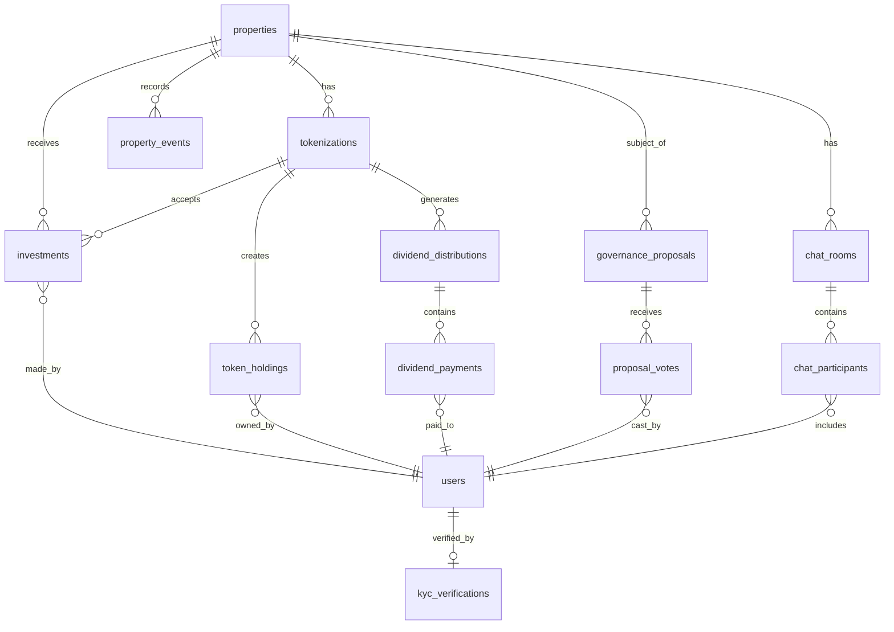

<a id="getting-started"></a>

## 🛠️ Getting Started

### Prerequisites

- Node.js 18 or higher
- npm or yarn
- Git
- Supabase account (for backend)
- Hedera testnet account (for blockchain)

### Environment Variables

Create a `.env` file in the project root:

```bash
# Supabase Configuration
VITE_SUPABASE_URL=your_supabase_url
VITE_SUPABASE_ANON_KEY=your_supabase_anon_key

# Hedera Configuration (Edge Functions)
HEDERA_OPERATOR_ID=0.0.xxxxx
HEDERA_OPERATOR_PRIVATE_KEY=302e...
HEDERA_NETWORK=testnet

# Paystack Configuration
PAYSTACK_SECRET_KEY=sk_test_xxx
PAYSTACK_PUBLIC_KEY=pk_test_xxx

# Smart Contract Addresses (Testnet)
GOVERNANCE_EXECUTOR_ADDRESS=0x637De4b8E8e39f97638485BdC90F937A5898daA7
DIVIDEND_DISTRIBUTOR_ADDRESS=0x418BC4d08A8ac4F2AeA9C71a9cf3BE7De0eB508A
MULTISIG_TREASURY_ADDRESS=0x2b461A252EEb91A11fE003e751aa98DA1D625F2C
PLATFORM_ESCROW_ADDRESS=0x72401B82c03fb61756A804785f3fA8C5AB65ea9B
```

### Installation

```bash
# Clone the repository
git clone <YOUR_GIT_URL>
cd <YOUR_PROJECT_NAME>

# Install dependencies
npm install

# Start development server
npm run dev
```

The application will be available at `http://localhost:5173`

### Database Setup

1. Create a new Supabase project
2. Run the migration files in `supabase/migrations/`
3. Execute smart contract configuration SQL (see Smart Contract section)
4. Set up Row Level Security policies (already included in migrations)

### Smart Contract Deployment

See `docs/SMART_CONTRACT_DEPLOYMENT.md` for detailed deployment instructions.

Quick start:

```bash
cd contracts
npm install
npx hardhat compile
npx hardhat run deployment/deploy-testnet.ts --network testnet
```

Deployed contract addresses can be found in `docs/SMART_CONTRACT_ADDRESSES.md`

<a id="smart-contract-integration"></a>

## 📝 Smart Contract Integration

### Deployed Contracts (Testnet)

| Contract | Address | Purpose |
|----------|---------|---------|
| GovernanceExecutor | `0x637De4b8E8e39f97638485BdC90F937A5898daA7` | On-chain proposal execution and fund management |
| DividendDistributor | `0x418BC4d08A8ac4F2AeA9C71a9cf3BE7De0eB508A` | Automated dividend distribution to token holders |
| MultiSigTreasury | `0x2b461A252EEb91A11fE003e751aa98DA1D625F2C` | Multi-signature treasury management |
| PlatformEscrowManager | `0x72401B82c03fb61756A804785f3fA8C5AB65ea9B` | Investment escrow until funding targets met |

### Integration Architecture

Edge functions interact with smart contracts through the `SmartContractService`:

```typescript
// Example: Creating a dividend distribution
const result = await smartContractService.createDistributionOnChain({
  propertyId: 'uuid',
  tokenizationId: 'uuid',
  totalAmount: '1000',
  perTokenAmount: '0.1',
  distributionPeriod: 'Q1 2024'
});
```

The service handles:

- Fetching contract configuration from database
- Initializing Hedera client
- Executing contract function calls
- Logging transactions to database
- Error handling and retries

### Event Monitoring

The system monitors smart contract events in two ways:

1. **Webhook**: Receives real-time events from Hedera (when configured)
2. **Polling**: `poll-contract-events` edge function queries Mirror Node
every 5 minutes

Supported events:

- `ProposalRegistered`
- `ProposalExecuted`
- `DistributionCreated`
- `DividendClaimed`
- `WithdrawalSubmitted`
- `WithdrawalApproved`
- `WithdrawalExecuted`

See `docs/SMART_CONTRACT_INTEGRATION.md` for detailed API documentation.

<a id="testing"></a>

## 🧪 Testing

### Frontend Testing

```bash
# Run in development mode
npm run dev

# Build for production
npm run build

# Preview production build
npm run preview
```

### Edge Function Testing

Test individual edge functions locally:

```bash
# Example: Test proposal creation
curl -X POST http://localhost:54321/functions/v1/create-proposal \
  -H "Authorization: Bearer YOUR_ANON_KEY" \
  -H "Content-Type: application/json" \
  -d '{
    "propertyId": "uuid",
    "title": "Test Proposal",
    "description": "Testing governance flow"
  }'
```

### Database Queries

Test database queries directly in Supabase SQL editor or use the Supabase client:

```typescript
// Example: Query token holdings
const { data, error } = await supabase
  .from('token_holdings')
  .select('*')
  .eq('user_id', userId);
```

### Smart Contract Testing

```bash
cd contracts
npx hardhat test
```

### Manual Testing Scenarios

1. **Complete Investment Flow**
   - Create account → Complete KYC → Setup wallet → Invest in property → Verify
   tokens received

2. **Dividend Distribution**
   - Record rental income → Create distribution → Claim dividend → Verify USDC received

3. **Governance Proposal**
   - Create maintenance proposal → Vote on proposal → Execute if approved →
   Verify funds locked

4. **Multi-sig Withdrawal**
   - Submit withdrawal request → Collect approvals → Verify automatic execution

5. **Property Event Recording**
   - Record inspection → Upload documents → Verify HCS submission →
   Check activity feed

<a id="architecture-diagrams"></a>

## 📖 Architecture Diagrams

### Overall System Flow

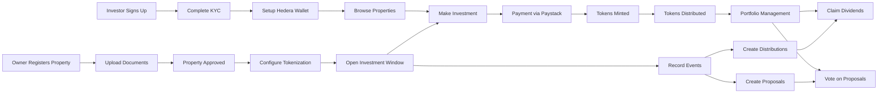

### Investment Window Lifecycle

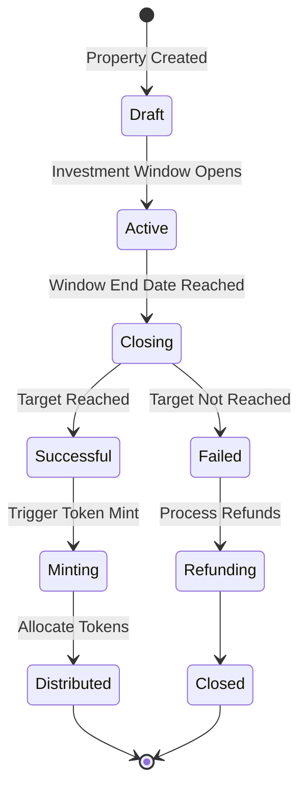

### Smart Contract Interaction Flow

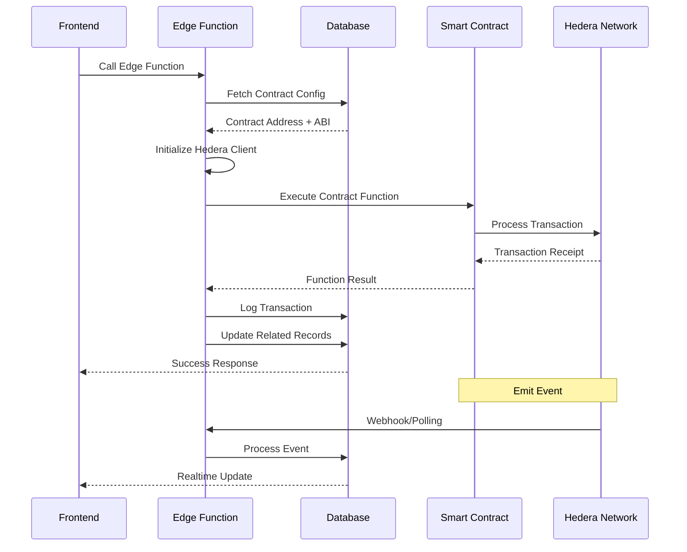

<a id="additional-documentation"></a>

## 📚 Additional Documentation

<a id="pitch-deck-certifications"></a>

## 📎 Pitch Deck & Certifications

- [Pitch Deck](https://propchain-ng.web.app/pitch) — overview of PropChain vision, traction, and roadmap
- [Hedera Certification](https://drive.google.com/file/d/1X-s1-udqsh5bbc7gDyNpcp_s416Jmw1w/view?usp=drive_link )
— official Hedera network certification credentials

<a id="security-considerations"></a>

## 🔐 Security Considerations

- Private keys stored as Supabase secrets, never in code
- Row Level Security (RLS) policies on all database tables
- KYC verification required before investments
- Multi-signature approvals for treasury withdrawals
- Investment limits enforced based on KYC tier
- Smart contract auditing recommended before mainnet
- Regular security scans and updates

## 🚀 Deployment

### Frontend Deployment

```bash
# Build for production
npm run build

# The dist/ folder contains the production build
```

### Edge Functions Deployment

Edge functions are automatically deployed through Supabase CLI:

```bash
supabase functions deploy
```

### Database Migrations

Apply migrations to production:

```bash
supabase db push
```

## 🤝 Contributing

This is a private project. For authorized contributors:

1. Create a feature branch
2. Make your changes
3. Test thoroughly
4. Submit a pull request

## 🆘 Support

For technical support or questions:

- Check Supabase logs for edge function errors
- Review Hedera Mirror Node for transaction history
- Contact the development team

---

**Project URL**: https://propchain-visuals.vercel.app OR https://propchain-ng.web.app/pitch

Built with ❤️ using React, Supabase, and Hedera Hashgraph
