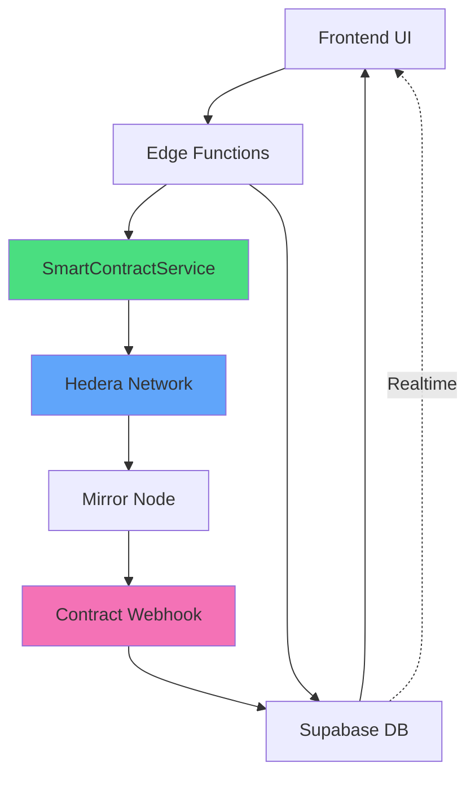
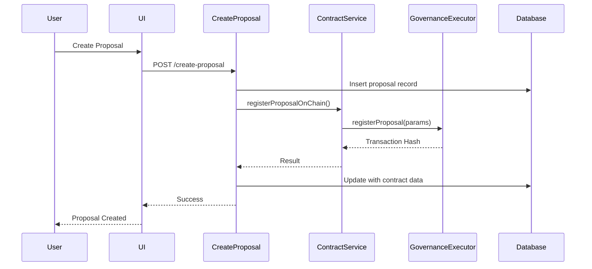
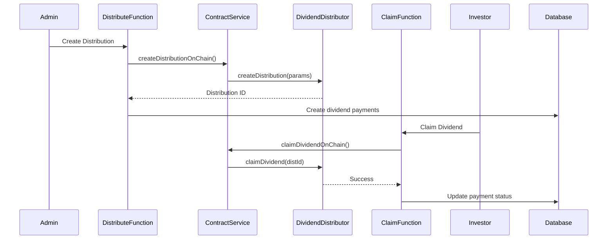
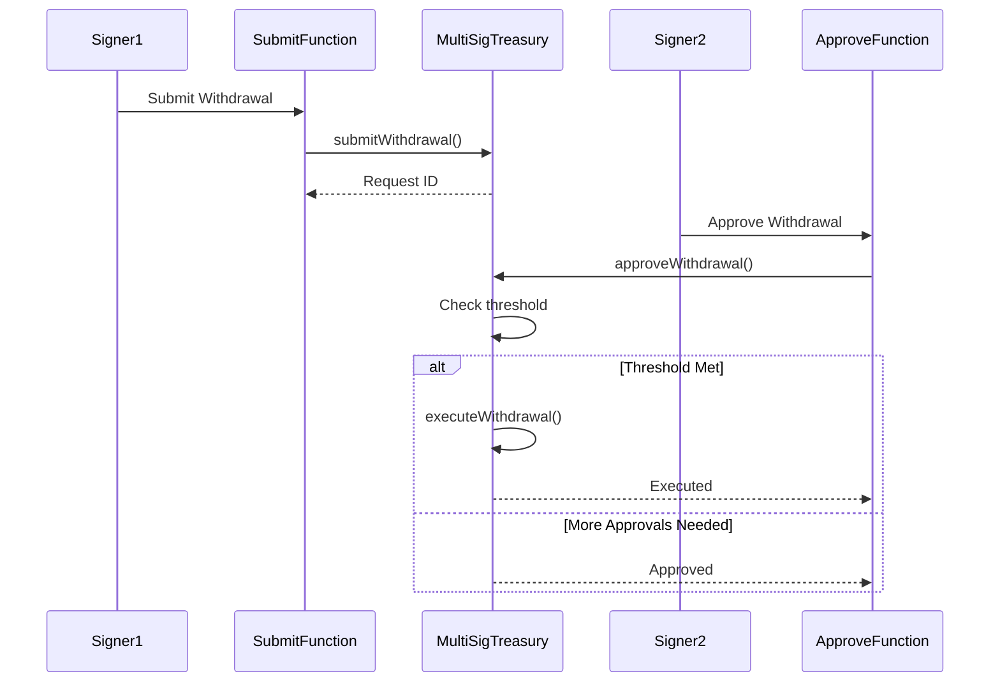

# Smart Contract Integration Architecture

This document explains how smart contracts integrate with the platform's edge functions and database.

## Architecture Overview



## Contract Flow Patterns

### 1. Governance Proposal Flow



### 2. Dividend Distribution Flow



### 3. Treasury Withdrawal Flow



## SmartContractService API Reference

### Constructor

```typescript
constructor(supabaseClient: any)
```

Initializes the service with Hedera client and Supabase connection.

### Core Methods

#### `registerProposalOnChain(data)`

Registers a governance proposal on the GovernanceExecutor contract.

**Parameters:**

```typescript
{
  proposalId: string;      // UUID of proposal
  propertyTreasuryAddress: string; // Treasury contract address
  budget: number;          // Budget in smallest unit
  proposalType: string;    // 'maintenance', 'improvement', etc.
  votingEnd: number;       // Unix timestamp
}
```

**Returns:**

```typescript
{
  txHash: string;          // Hedera transaction ID
  contractAddress: string; // GovernanceExecutor address
  proposalId: string;      // Confirmation of proposal ID
}
```

#### `createDistributionOnChain(data)`

Creates a dividend distribution on the DividendDistributor contract.

**Parameters:**

```typescript
{
  distributionId: string;  // UUID of distribution
  tokenContract: string;   // Token ID (e.g., "0.0.12345")
  totalAmount: number;     // Total distribution amount
  perTokenAmount: number;  // Amount per token
  snapshotBlock: number;   // Block number for snapshot
}
```

**Returns:**

```typescript
{
  txHash: string;
  contractAddress: string;
  distributionId: string;
}
```

#### `claimDividendOnChain(data)`

Claims a dividend for the caller.

**Parameters:**

```typescript
{
  distributionId: string;  // UUID of distribution
}
```

**Returns:**

```typescript
{
  txHash: string;
  contractAddress: string;
}
```

#### `submitTreasuryWithdrawal(data)`

Submits a withdrawal request to MultiSigTreasury.

**Parameters:**

```typescript
{
  treasuryAddress: string; // Treasury contract address
  recipient: string;       // Recipient address
  amount: number;          // Withdrawal amount
  reason: string;          // Withdrawal reason
}
```

**Returns:**

```typescript
{
  txHash: string;
  requestId: string;       // Withdrawal request ID
}
```

#### `approveTreasuryWithdrawal(data)`

Approves a pending withdrawal request.

**Parameters:**

```typescript
{
  treasuryAddress: string;
  requestId: number;       // Request ID from contract
}
```

**Returns:**

```typescript
{
  txHash: string;
  executed: boolean;       // True if threshold met and executed
}
```

## Event Monitoring

### Smart Contract Webhook

The `smart-contract-webhook` function processes contract events:

**Event Types:**

- `ProposalExecuted`
- `FundsLocked`
- `FundsReleased`
- `DividendClaimed`
- `DistributionCreated`
- `WithdrawalExecuted`

**Event Payload:**

```typescript
{
  eventName: string;
  contractName: string;
  contractAddress: string;
  transactionHash: string;
  blockNumber: number;
  data: {
    // Event-specific data
  }
}
```

### Polling Strategy

The `poll-contract-events` function:

1. Runs every 5 minutes (via cron)
2. Queries Hedera Mirror Node for new events
3. Processes events through webhook
4. Updates database with confirmed transactions

## Database Schema

### smart_contract_config

Stores deployed contract information:

| Column | Type | Description |
|--------|------|-------------|
| contract_name | text | e.g., 'governance_executor' |
| contract_address | text | Hedera contract address |
| abi | jsonb | Contract ABI |
| contract_version | text | Version string |
| deployment_network | text | 'testnet' or 'mainnet' |
| deployed_at | timestamp | Deployment timestamp |
| is_active | boolean | Active status |

### smart_contract_transactions

Logs all contract interactions:

| Column | Type | Description |
|--------|------|-------------|
| contract_name | text | Contract identifier |
| contract_address | text | Contract address |
| function_name | text | Called function |
| transaction_hash | text | Hedera TX ID |
| transaction_status | text | 'pending', 'confirmed', 'failed' |
| block_number | bigint | Block number |
| gas_used | bigint | Gas consumed |
| input_data | jsonb | Function parameters |
| output_data | jsonb | Return values |
| related_id | uuid | Related DB record ID |
| related_type | text | Record type |

## Error Handling

### Fallback Strategy

All edge functions implement graceful degradation:

1. **Try**: Execute contract call
2. **Catch**: Log error, use simulated fallback
3. **Continue**: Don't block user operations

```typescript
try {
  const result = await contractService.registerProposalOnChain(data);
  // Use real contract result
} catch (contractError) {
  console.error('❌ Contract call failed:', contractError);
  // Use simulated fallback
  const fallbackTxHash = `0x${Date.now()}_fallback`;
  // Continue with fallback
}
```

### Gas Estimation

Service automatically estimates gas based on function complexity:

- Simple reads: 100,000 gas
- Writes: 1,000,000 gas
- Complex operations: 2,000,000 gas

## Security Considerations

1. **Private Key Management**: Operator keys stored in env variables, never committed
2. **Authorization**: All edge functions verify user auth before contract calls
3. **Gas Limits**: Reasonable limits prevent runaway transactions
4. **Error Logging**: Failed transactions logged for audit trail
5. **Fallback Mode**: Platform remains operational even if contracts fail

## Testing

See `docs/TESTING_GUIDE.md` for comprehensive testing instructions.

## Production Checklist

- [ ] All contracts deployed and verified
- [ ] Database populated with contract configs
- [ ] Environment variables configured
- [ ] Webhook endpoint secured
- [ ] Event polling cron job active
- [ ] Monitoring dashboard set up
- [ ] Emergency procedures documented
